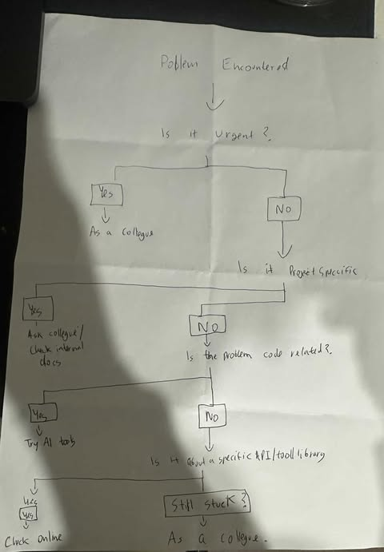

When you get stuck - what next?: Reflection

///////When do you prefer using AI vs. Google?////////

I prefer using AI tools like ChatGPT when:
- I need fast, contextual help, for example understanding an error message.
- I want explanations in simple language and/or need it similar to what my code is like.
- When I need to new ways to approch a challenge that I am facing and need ideas.
- I’m learning a new topic and want a step-by-step breakdown instead of sifting through multiple web pages.

I prefer Google when:
- I’m looking for reliaable documentation, forum posts: like GitHub issues that I can know for sure are accurate.
- I need to search for specific libraries or API behavior.
- I want to compare different answers, especially when ChatGPT’s response might be outdated or made up completly as gpt tends to do that a fair lot.

////////How do you decide when to ask a colleague instead?//////////

I ask a colleague when:
- The problem involves sensitve company codebases or systems that I can not use AI assitance which can compremise the data.
- I’ve already done some groundwork eg. tried AI/Google and still am unsure.
- I know the problem might impact the work of others in the team.
- The fix might depend on how we do things for this specific project or for focus bear.

I avoid asking too early. First try AI or search online unless the issue is clearly team-specific or time-sensitive.

/////////What challenges do developers face when troubleshooting alone?///////

- Confirmation bias: One might think that they found the issue but ignore the underlying issue.
- Lack of perspective: Debugging at the same code too long can make obvious bugs invisible which someone else can easily spot.
- Information overload: Google/Stack Overflow results can be overwhelming.
- Debugging burnout: One can lose motivation when stuck for too long without support.
- Wasting time: Sometimes a quick chat with someone could save hours of guessing/figuring it out as they might spot the issue quicker.

That's why combining tools (AI, docs, peers) smartly is key.

/////////////Summary//////////////

Each tool has strengths:
- When to ask ChatGPT: to explain or scaffold.
- When to search Google: for source based answers.
- When to loop in a teammate: to resolve internal/system specific issue.

The decision tree: 
