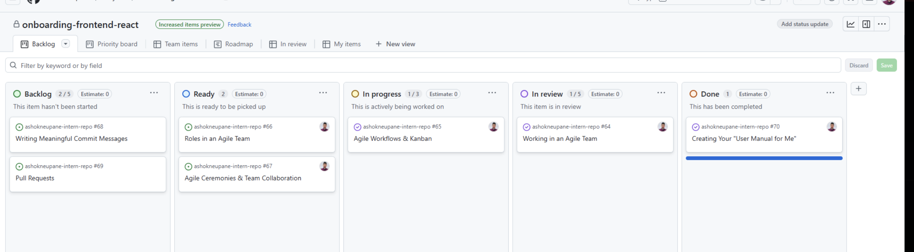

Agile Workflows & Kanban

🔍 Research & Learn

How does a Kanban board work, and how does it help manage workflow?

- The Kanban board helps visualise the tasks as they move through diffrent stages of clomplition, which helps the team identify potential bottlenecks and helps the team manage the workflow in a more steady manner. It helps avoid issues related to starting too many tasks at once which can lead to numerious tasks being left uncompleted or alleast not to a high satndard in terms of quality.

What do the different columns on a Kanban board represent? (e.g., Backlog, In Progress, Blocked, Done)

- Backlog: Items/Tasks that have not yet been started.
- To: The work that is to be completed/ ready to be started.
- In progress: Tasks that are being worked on.
- Blocked: Task that have faced an issue and can not be continued.
- Done: Completed tasks.

How do tasks move through the board, and who is responsible for updating them?

- Teammembers put tasks in progress when they start working on them.
- When the task progresses to the next stage it is updated.
- Overall the individual/team member working on a certain task is responsible for updating the task on the board.

What are the benefits of limiting work in progress (WIP)?

- Encourages completion: team members finish current tasks before starting a new one.
- Reduces mutitasking, thus enhancing the quality of the output.
- Helps maintain a consistent flow of work, and thus the predictability of completion.

📝 Reflection

How does Kanban help manage priorities and avoid overload?

- The kanban not only provides a visible representation of the progress on each task, it also allows the team to visualise what tasks are stuck and thus priorotise them and ensure completion ensurinf that the team complted unfinished tasks before starting new ones.

How can you improve your workflow using Kanban principles?
The Kaban principles can help me break down tasks and

🛠️ Task

Check out Focus Bear’s Kanban board and note how tasks are structured. (Hint: Look in GitHub Projects.)

- The kanban board is structured in a very sequential manner almost like a waterfall work methodology, where each task is completed in a predetermined sequence. The task are complied in the Backlog innitialy which means the item has not yet been worked on and/or isnt ready to be worked on as of now. After that is the Ready section which cosists of tasks that are ready to be picked up by a team member however have not yet been started. Then comes the in progress section which has all the tasks that are currently being worked on by a team member. The in review sections consists of item that have been completed however the works needs to be reviewed before being determined complete/ Finially it is the completed section which has all the completed items.

Move at least one task through the Kanban process and update its status correctly.

- I am currently working on the onboarding and do not have direct acess to the kanban board or any task that is being worked on by the team. Thus I am unable to move the kanban board item from one stage to another.

Identify one way you can improve task tracking in your role.
One way I can improve the tracking of items once I have access to the Focus Bear Kanban board is by adding more descriptive titles and summarys for when items are moved from one stage to another. More detailed notes/titles will significantly enhance the qulaity of the kanban board as it will add clarity and help team members understand what the task involved and what has been done.
